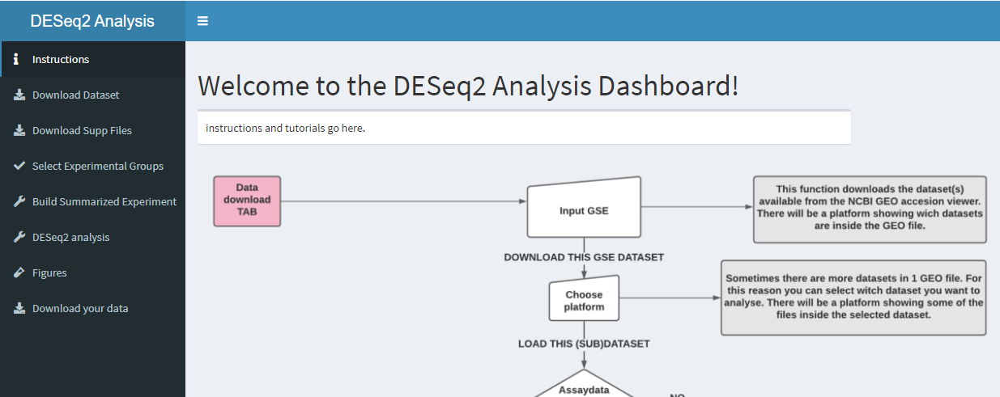

# The dashboard created with Shiny

In these chapters we'll show you the functions that we used to create the application. 
In the picture below you see the front page of the dashboard. 
```{r}

```
