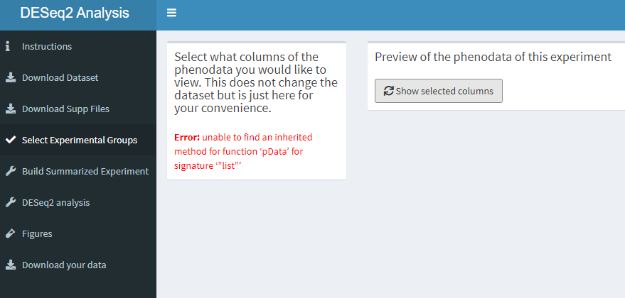

## Groupselection tab
In this section you're supposed to see all the information about the experiment, like experimental groups but also how to contact the researchers. 
Because this section doesn't work we only show how it looks like.

How the experimental groups tab looks like.  
```{r echo=FALSE}

```
