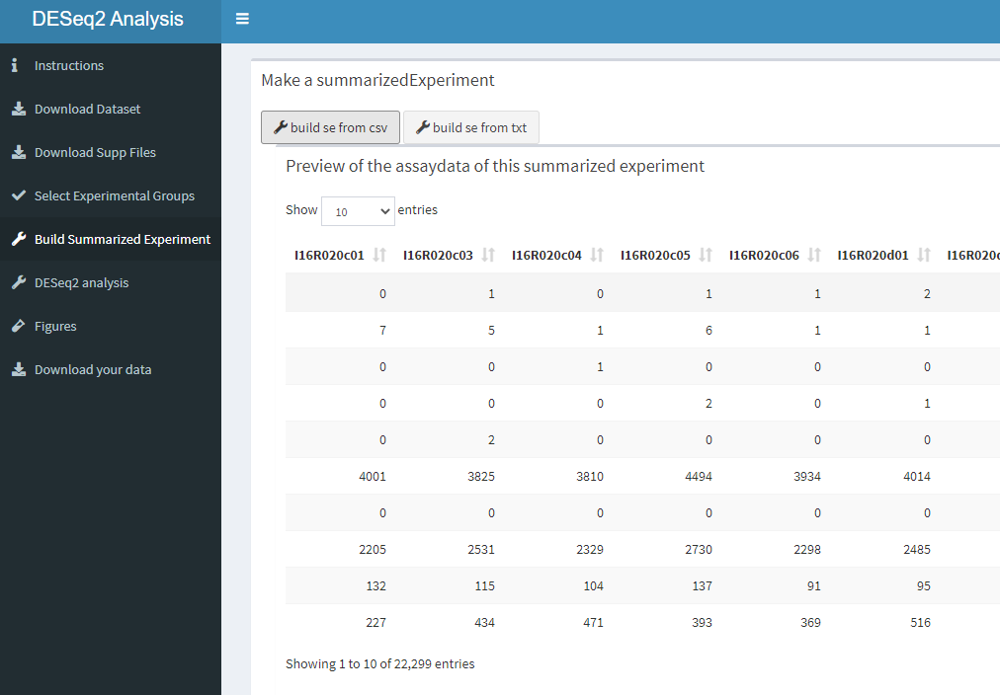

## Build summarized experiment function
### The working code behind the application. 

In the code below we will create a function for building a summarized experiment. This function will be called "build_summ_exp_function_csv". To begin we will create the phenodata. The the colnames are then created by seperating the different characteristics of the dataset. By line 33 there is a path created where the data will be stored on the server. Here you can also see that the code is created for csv files. For furher research we will only need the raw counts from the dataset. These are isolated. At the end the metadata is created. The function return() wil return the results. 


```{r eval= FALSE}
build_summ_exp_function_csv <-function(gse_id_number){
  
  phenodata_data <- getGEO(gse_id_number) 
  phenodata_tbl <- map_df(phenodata_data,
                          pData) %>% as_tibble()
  
  colnames(phenodata_tbl)[11] <- "dev_stage"
  colnames(phenodata_tbl)[12] <- "genotype"
  
  
  phenodata_csv <- phenodata_tbl[2:41]
  
  samplenames_csv<- phenodata_tbl[1]
  
  load_csv_data <- list.files(path = here::here("data", gse_id_number), full.names = TRUE, pattern = ".csv")
  
  csv_data <- read.csv(load_csv_data)
  
  raw_counts_csv_data <- csv_data[2:21]
  
  raw_counts_csv_data_matrix <- data.matrix(raw_counts_csv_data)
  rowdata_csv_data <- raw_counts_csv_data$`Gene symbol`
  rownames(raw_counts_csv_data_matrix) <- rowdata_csv_data
  
  colnames(raw_counts_csv_data) <-samplenames_csv[[1]]
  
  se <- SummarizedExperiment(assays = raw_counts_csv_data_matrix,
                             rowData = rowdata_csv_data,
                             colData = phenodata_csv)
  
  metadata(se)$metadata <- metadata 
  
  return(se)
  
}
```

### Shiny
#### Server.R 

In the code below from the server, the created function for summarized experiment is used. The output of the code below is the assay data (raw counts) from the dataset. We renamed se to se_2, because the code wouldn't work if the name was the same as the se name in the function. 
```{r eval= FALSE}
se_2 <- eventReactive(input$build_sum_csv, {
     build_summ_exp_function_csv(gse_id_number())
      
   })
  
   output$tbl_assaydata_preview <- DT::renderDataTable(
     SummarizedExperiment::assay(se_2()),
      style = "bootstrap",
      server = TRUE)
``` 


#### ui.R

Below is the code for the tab that contains the summarized experiment. The checkboxGroupInput is turned off, because this wasn't working probaly. We wanted to add this in so that the user can change the chosen names. 
The last box shows the selected colnames of the phenodata. 

```{r eval= FALSE}
    tabItem(tabName = "build_summarized_experiment",
            verticalLayout(   
              
              box(
                title = "Make a summarizedExperiment",
                width = "10",
                #actionButton("setup_se", label = "setup for summerizedExperiment", icon("download", lib = "font-awesome")),
                
                #build experiment
                #checkboxGroupInput("sample_choises", "selected_samples"),
                #textInput("test_selected", "Enter a copy of the sample_choises you want to test."),
                actionButton("build_sum_csv", "build se from csv", icon = icon("wrench", lib = "font-awesome")),
                actionButton("build_sum_txt", "build se from txt", icon = icon("wrench", lib = "font-awesome")),
                
                box(
                  title = "Preview of the assaydata of this summarized experiment",
                 width = "12",
                 dataTableOutput("tbl_assaydata_preview")
                )
               )))
```

How this Summarized Experiment tab looks like.
```{r echo=FALSE}

```


