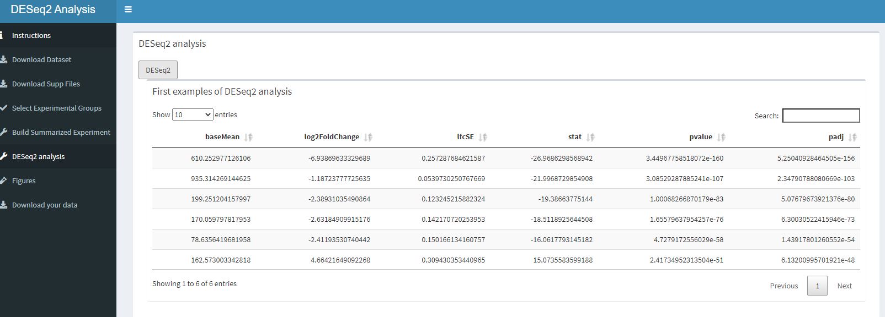

## Deseq2 function
```{r eval=FALSE}
#DESeq2 function (only head, what does this?)
#Loading the se we just made in the Summarised Experiment
deseq2_function <- function(se_input){
  ddsSE <- DESeq2::DESeqDataSet(se_input, design = formula(~dev_stage + genotype))
  
  #With this part we select only genes with more than 10 counts
  keep <- rowSums(counts(ddsSE)) >= 10
  ddsSE <- ddsSE[keep,]
  
  #run differential expression analysis
  ddsDE<- DESeq(ddsSE)
  
  #Results
  res <- results(ddsDE)
  head_res <- res[order(res$padj), ] %>% head
  #all_res <- res[order(res$padj)]
  return(head_res)
}

#as.matrix(deseq2_function(se_input = testdata))

```

###Make DESeq2 tab
This page is quite simple, we make a box where the data will be rendered. With an actionbutton the user will be able to activate the "deseq2_function" 

```{r eval=FALSE}
#deseq2 tab UI
#Hoe kunnen we alleen de code laten zien, maar niet laten lopen?
tabItem(tabName = "make_DESeq2",
        verticalLayout(
         
          box(
            title = "DESeq2 analysis",
            width = "10",
            actionButton("calculate_DESeq2", "DESeq2"),
            
          box(
            title = "First examples of DESeq2 analysis",
            width = "12",
            dataTableOutput("matrix_DESeq2")
          ))
          ))
```

With this part of the code we tell what to use for the se_input. This is the se_2 we created in the last function (summarized experiment)
```{r eval=FALSE}
#deseq2 tab server
head_res <- eventReactive(input$calculate_DESeq2, {
    deseq2_function(se_input = se_2())
  })
  
  output$matrix_DESeq2 <- DT::renderDataTable({
    as.matrix(deseq2_function(se_input = se_2()))
  })
```

The DESeq2 function will give a output shown below.
```{r eval=FALSE, include=FALSE}
DESeq2_page <-  here::here("eindverslag", "images", "Deseq2.PNG")
```

How the DESeq2 tab looks like.
```{r echo=FALSE}

```


