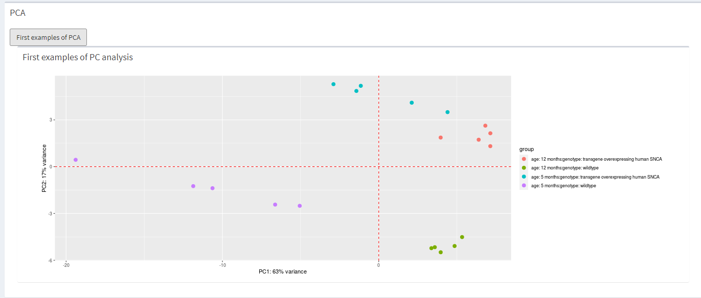
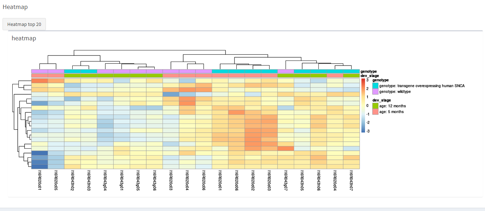
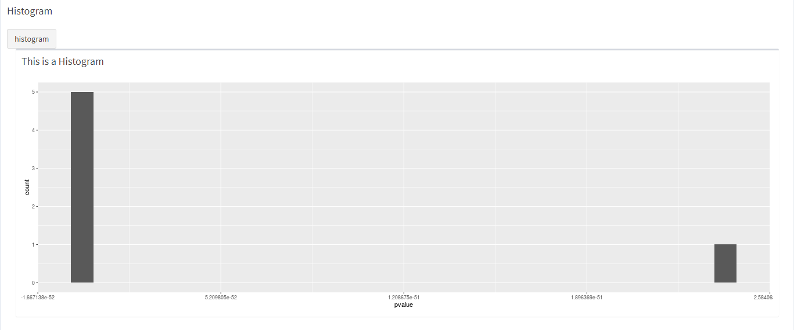
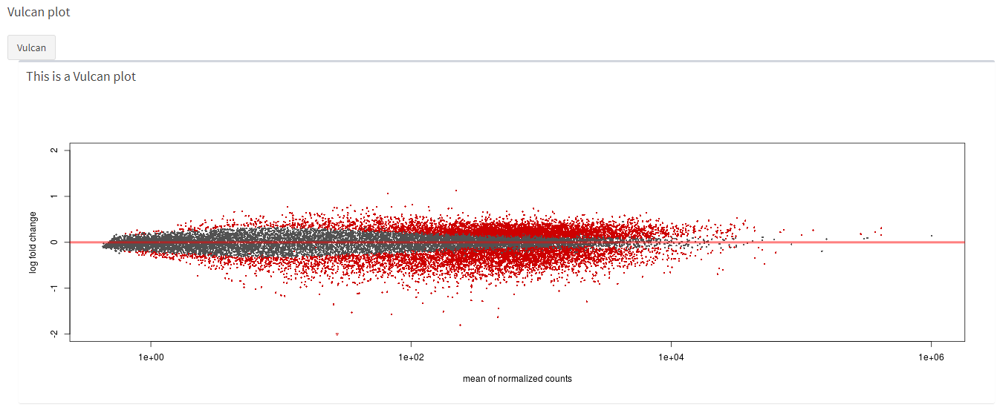

## Figures
Inside the figure tab we need to make boxes so the figures have a place to go, we also have to make an actionbutton so only the figures you want will be displayed. For now this doesn't work. Pressing one button will give you all the figures. This will give a long loading time, so we want to add a loading barr.  
This is a big chapter, we show the functions for all 4 figures at the same time.

```{r eval= FALSE}
#figures tab UI
tabItem(tabName = "make_figures",
        fluidRow(
          
          box(
            title = "PCA",
            width = "10",
            actionButton("calculate_PCA", "First examples of PCA"),
            
            box(
              title = "First examples of PC analysis",
              width = "12",
              plotOutput("matrix_PCA")
            )),
            
            box(
              title = "Heatmap",
              width = "10",
              actionButton("calculate_heatmap", "Heatmap top 20"),
              
              box(
                title = "heatmap",
                width = "12",
                plotOutput("matrix_heatmap")
              )),
          
          box(
            title = "Histogram",
            width = "10",
            actionButton("calculate_histogram", "histogram"),
            
            box(
              title = "This is a Histogram",
              width = "12",
              plotOutput("matrix_Histogram")
            )),
          
          box(
            title = "Vulcan plot",
            width = "10",
            actionButton("calculate_Vulcan", "Vulcan"),
            
            box(
              title = "This is a Vulcan plot",
              width = "12",
              plotOutput("matrix_Vulcan")
            ))
          
            ))
```

```{r eval= FALSE }
#figures tab server 
#PCA plot maken
  pca_plot <- eventReactive(input$calculate_PCA, {
    pca_function(se_input = se_2())
  })
  
  output$matrix_PCA <- renderPlot ({
    pca_function(se_input = se_2())
  })
  
  #Heatmap maken
  heatmap_plot <- eventReactive(input$calculate_heatmap, {
    heatmap_function(se_input = se_2())
  })
  
  output$matrix_heatmap <- renderPlot ({
    heatmap_function(se_input = se_2())
  })
  
  #Histogram
  histogram_plot <- eventReactive(input$calculate_histogram, {
    geom_histogram_function(se_input = se_2())
  })
  
  output$matrix_Histogram <- renderPlot ({
   geom_histogram_function(se_input = se_2())
  })
  
  #Vulcan
 vulcan_plot <- eventReactive(input$calculate_Vulcan, {
    vulcan_function(se_input = se_2())
  })
  
  output$matrix_Vulcan <- renderPlot ({
    vulcan_function(se_input = se_2())
  })
```

How the PCA looks like.
```{r echo=FALSE}

```
How the heatmap looks like.
```{r echo=FALSE}

```
How the histogram looks like.
```{r echo=FALSE}

```
How the vulcan plot looks like.
```{r echo=FALSE}

```


