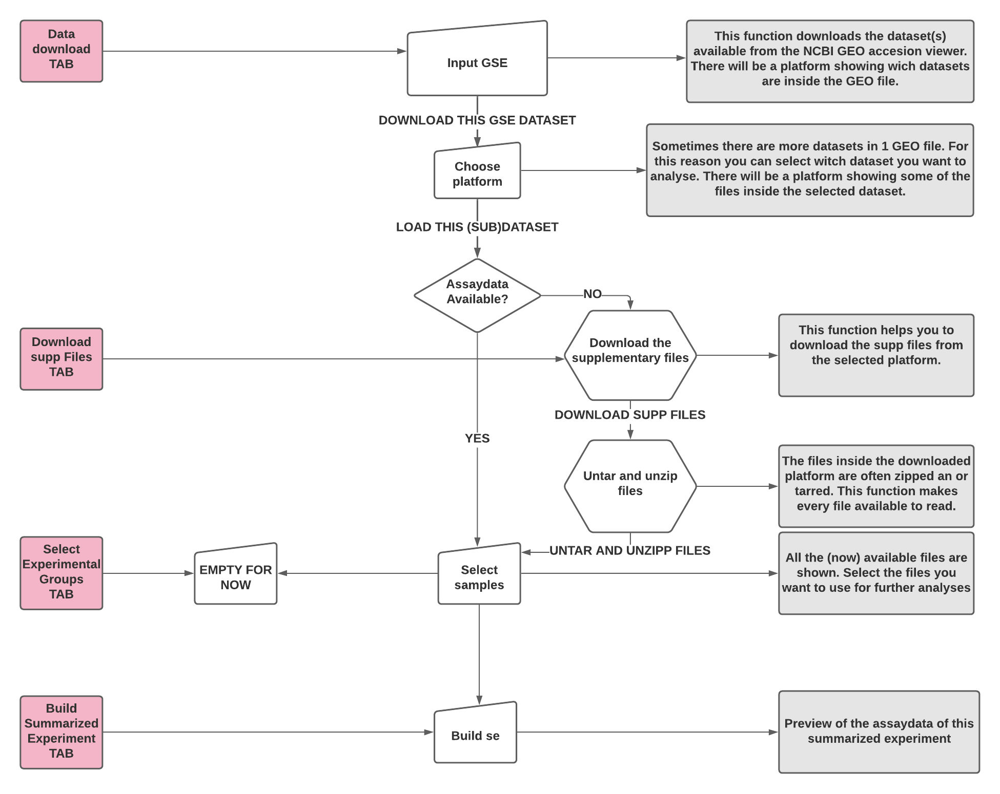

--- 
title: "A dashboard for analysing genomics data"
author: "Created by Jelmer Oedzes and Sanne Schild"
date: "`r Sys.Date()`"
site: bookdown::bookdown_site
documentclass: book
bibliography: [book.bib, packages.bib]
biblio-style: apalike
link-citations: yes
description: "RNA seq."
params:
  data1: dev_stage
  data2: genotype
  geo_dataset: GSE150646
---

# Overview

```{r echo=FALSE}

```


